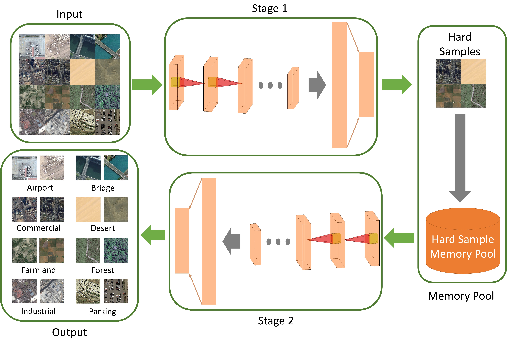

# CFMP

Code for Paper: A Convolutional Fully Connected Structure with Hard Sample Memory Pool for Land Use Classification

[Presentation](https://spie.org/defense-commercial-sensing/presentation/A-convolutional-fully-connected-structure-with-hard-sample-memory-pool/11735-12)

## Abstract

As one of the classic fields of computer vision, image classification has been booming with the improvement of chip performance and algorithm efficiency. With the rapid progress of deep learning in recent decades, remote sensing land cover and land use image classification has ushered in a golden period of development. This paper presents a new deep learning classifier to classify remote sensing land cover and land use images. The approach first uses multi-layer convolutional neural networks to extract the image features, attached through a fully-connected neural network to generate the sample loss. Then, a hard sample memory pool is created to collect the samples with large losses during the training. A batch of hard samples is randomly extracted from the memory pool to participate in the training of the convolutional fully connected model so that the model becomes more robust. Our method is validated by testing the classic remote sensing land cover and land use dataset. Compared with the previous popular classification algorithm, our algorithm can classify images more accurately with a shorter training iteration.

## Introduction

The experiment results are saved in logs folder.

We use the AID dataset to test our algorithm. You may download the dataset [here](https://captain-whu.github.io/AID/) and put it in data folder.

For the training mode, you can run <code>python ultimate_train_ohem.py</code> to train your own model. The model will be save in the checkpoints folder.
